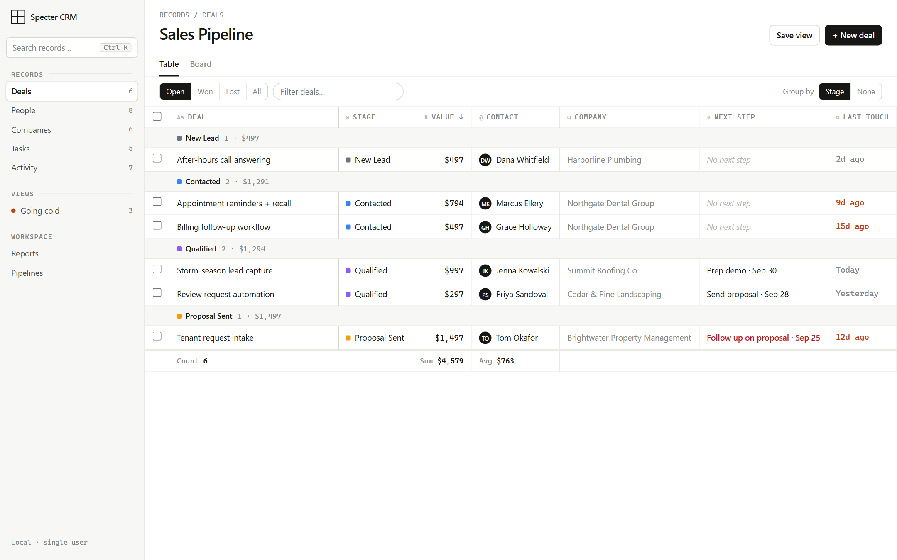
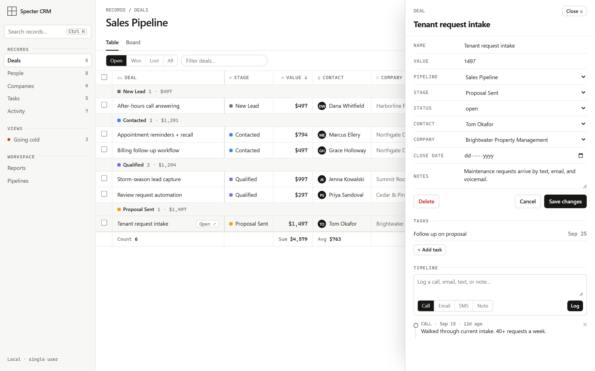
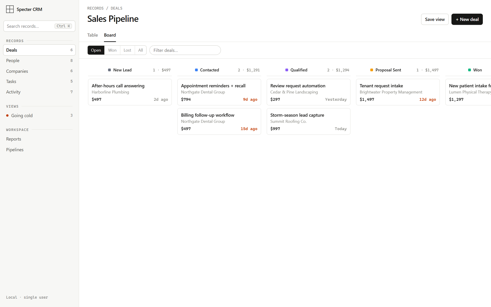
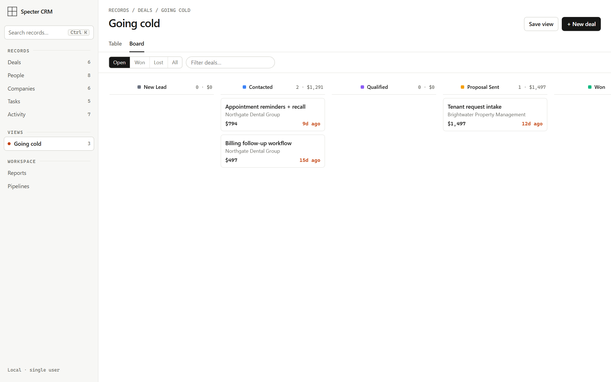
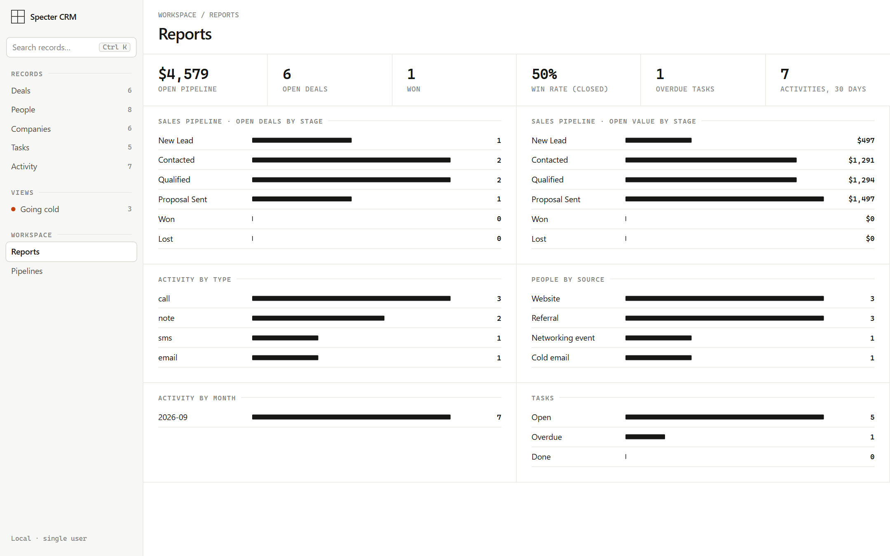
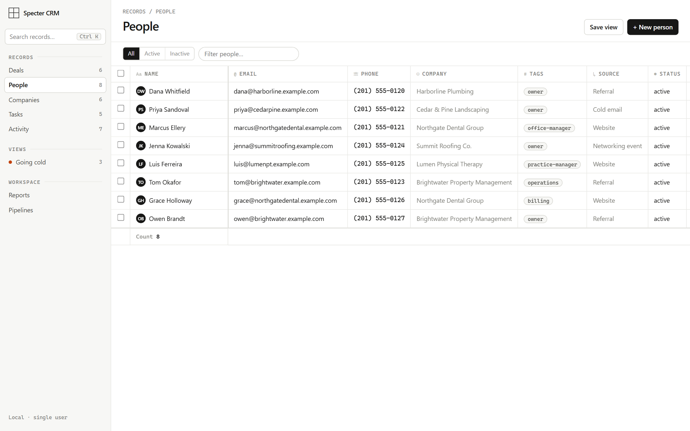
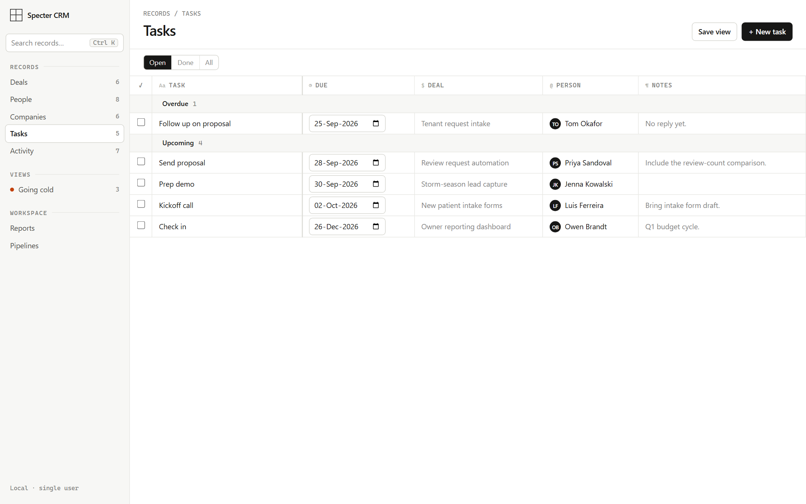

# CRM

A self-contained, single-user CRM: deals, people, companies, tasks, an activity log, pipelines,
saved views, search, and reports. It runs entirely on your own machine with a local SQLite file.
There is no build step and no third-party JavaScript, and the page loads nothing from the internet,
so it works offline.

The interface is **Ledger**: the CRM treated as a spreadsheet you can trust. It was chosen from five
design directions prototyped side by side. One ink, hairline grid, and colour only where it means
something (stage colours, deals going cold, overdue tasks). Numbers are monospaced and right-aligned.



| A record, with its timeline | Board |
|---|---|
|  |  |
| **Going cold** | **Reports** |
|  |  |
| **People** | **Tasks** |
|  |  |

## What it does

- **Tables you edit in place.** Click a deal's name or value and type. Change a stage from its
  dropdown. Rows group by stage with running counts and totals, and the footer sums what's on screen.
- **A record panel instead of page loads.** Open any deal, person, company, or task in a side panel
  to edit every field, see related records, and log calls, emails, texts, and notes on its timeline.
- **Every deal shows its next step and its last touch.** An open deal untouched for 7 days is
  "going cold" and turns orange. Tasks are linked to deals, so a deal with no open task says so.
- **Board view.** Drag a card between stages. Dropping it on Won or Lost closes the deal.
- **Bulk actions, saved views, and search.** Select rows to move or delete them together, save any
  filter as a view in the sidebar, and press Ctrl+K (⌘K) to jump to any person, company, or deal.
- **Reports and pipeline settings.** Open pipeline, win rate, stage breakdowns, activity mix, and
  task status. Pipelines and their stages (names, colours, order) are edited in place.

## Run it

Needs Python 3.11 or newer. From a clone of this repo:

- **Windows:** double-click `crm/launch.bat`
- **macOS / Linux:** `sh crm/launch.sh`

The first run creates a `.venv` at the repo root, installs the two dependencies, and asks
**"Load fictional demo data? [Y/n]"**. Then it starts the server and opens http://localhost:8090.
Later runs go straight to the server. To get the demo data back, stop the server, delete
`crm/crm.db`, and run the launcher again.

Opening `crm/index.html` directly won't work: the page needs its server, and says so if you try.

<details><summary>Manual setup</summary>

```bash
python -m venv .venv
.venv/Scripts/activate            # Windows  (macOS/Linux: source .venv/bin/activate)
pip install -r crm/requirements.txt
python -m crm.seed_demo           # optional: loads fictional demo data
python -m uvicorn crm.server:app --host 127.0.0.1 --port 8090
```

</details>

The database is `crm/crm.db`. Set `CRM_DB_PATH` to use a different file, which is how the demo
data can live somewhere disposable. To serve on a port other than 8090, set `CRM_PORT` to the same
number, because the write guard below only accepts requests from the page's own origin.

## Stack

- **Backend:** FastAPI with one router per entity (`routers/`), Pydantic models (`models.py`), and
  plain parameterized SQL against SQLite (`db.py`). No ORM.
- **Frontend:** one `index.html` with plain CSS and JavaScript against the JSON API. No framework,
  no bundler, no CDN. All user content is HTML-escaped before rendering, which the test suite
  checks by creating a person named ``.
- **Demo data:** `seed_demo.py` creates records through the same handler functions and Pydantic
  models the API uses, so the demo data passes the same validation a user's input would. It then
  backdates timestamps (plain SQL, since the API always stamps "now") so deals have realistic ages
  and some are visibly going cold.

## Security model

This is a **local, single-user tool**. It has no login, and it is meant to listen only on
`127.0.0.1`. **Do not expose it on a network or the internet as it stands.**

Having no login does not mean having no protection. A web page on any other site can still send
requests to `localhost` from your browser, so the server blocks the two ways that goes wrong:

| Attack | What it would do | Defence |
|---|---|---|
| **DNS rebinding**: an attacker's domain re-resolves to 127.0.0.1 | Their page becomes "same-origin" with the CRM and can read every record | Requests whose `Host` isn't `localhost`/`127.0.0.1` are refused (400) |
| **Cross-site writes**: a hostile page submits a form or `text/plain` POST | Creates, edits, or deletes records | Any write from a browser whose `Origin` isn't this server is refused (403) |

Recent FastAPI versions already reject non-JSON bodies, so the second attack failed before the fix.
Older versions parse them, and the dependency pin allows older versions, so the guard is there
regardless. Both were tested by sending each attack at the running app. The guards live at the top
of `server.py`.

Hosting it for multiple users would need real authentication, per-user data, and HTTPS, which are
deliberately out of scope here.

## Bugs found in review, all fixed

Before publishing, I cloned this repo into a clean environment, followed this README exactly, and
exercised every endpoint and screen with the network blocked. That found, in the server:

- **Leaving an optional link blank crashed the save.** The forms send `""` for "no company", which
  the server treated as a real id and failed the foreign-key check with a 500. Blank references now
  mean "none", and sending one on an edit unlinks the record.
- **Dragging a deal into Won left it counted as open pipeline.** Stage and status were independent,
  so the dashboard and win rate ignored the move. Moving into Won or Lost now closes the deal, and
  moving it back out reopens it.
- **Renaming a contact didn't reach their deals, tasks, or activities**, which store the name for
  fast listing. Company renames already propagated; contact and deal renames now do too.
- **The pipeline chart showed every open deal in one bar.** The stage query had no `GROUP BY`.
- **Win rate counted open deals as losses.** It's now won out of closed deals.
- **The demo seeder crashed on a clean install** because it depended on a test client that isn't in
  the requirements.

The previous interface (Alpine.js, Tailwind, Chart.js, and SortableJS from CDNs at floating
versions) also ran its `init()` twice on every load and drew a chart after its canvas was gone. The
Ledger rewrite replaced it and has no third-party scripts at all.

A second review of the published repo found four more in the Ledger page, all fixed. When the
server refused an action (say, deleting a stage that still had deals), the message showed but the
error also escaped as an unhandled rejection. The board's Won filter still showed lost deals.
"Select all" on a filtered list selected everyone. And stage colours reached a style attribute
unchecked. It also found that the launcher never offered demo data, so a first run showed an
empty CRM with no hint why.

## Tests

Two checks in `crm/tests/`, each run against a server on a **freshly seeded** demo database (they
change the data, so a second run on the same database fails by design):

```bash
CRM_DB_PATH=/tmp/demo.db python -m crm.seed_demo
CRM_DB_PATH=/tmp/demo.db python -m uvicorn crm.server:app --host 127.0.0.1 --port 8090 &
python crm/tests/api_check.py      # standard library only
python crm/tests/ui_check.py       # pip install playwright && playwright install chromium
```

- **`api_check.py`** calls every endpoint, including each review fix: status following Won/Lost,
  renames propagating, blank links unlinking, bad references returning 400, and both attack guards.
- **`ui_check.py`** drives a real browser through 27 steps with every non-local request blocked:
  every view, inline edits, stage changes, the record panel, logging activity, creating and
  unlinking records, board drag-and-drop into Won, bulk moves, tasks, Ctrl+K, saved views, pipeline
  settings, reports, deletion, and three regressions from review (cents surviving an edit, letters
  refused in a value cell, Escape cancelling). It fails on any console error or failed request, not
  only on a failed step. The regression steps were checked to fail against the page before the fix.

Both exit non-zero on failure. That was checked, not assumed: both fail with no server running,
and the UI check fails on an already-used database.

## Known limits

- Status follows stage only for stages named Won or Lost. A renamed closing stage would need its
  status set by hand in the record panel.
- "Going cold" uses a fixed 7-day threshold.
- The board scrolls sideways once a pipeline has more stages than fit on screen.
- The page loads up to 5,000 records of each type and draws 500 rows at a time (with "Show all"),
  which keeps a 3,000-deal table under a quarter of a second to switch to. Counts and totals always
  cover every loaded row.
